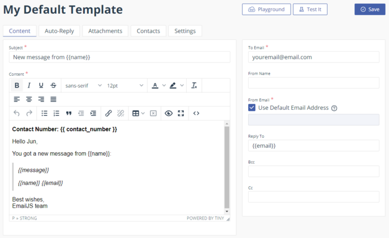

# Integrating Contact Form with Email.js and React-Hook-Form

As competitive web developers, we want to have a great portfolio that showing the biography of us, and our wonderful projects.

Imagine that job recruiters or employers are visiting your portfolio. Our goal is to make them contact us easily while they are browsing our portfolio if they are interested in our projects.

But, what if there is no way of contacting us directly in the portfolio? Not everyone wants to visit our github, linked-in, or even go to their email platform to send us a message. Make the visitors convenient to contact us easily in our portfolio, that's our goal.

In this tutorial, I am going to talk about how to integrate a contact form in our **React Portfolio** for visitor's convenience with [**Email.js**](https://www.emailjs.com/) and [**React-Hook-Form**](https://react-hook-form.com/).

Let's get started!

## Contact Component

If you already have your **React Portfolio** directory, ignore this part. If you haven't created, create your **React Portfolio** first by typing the following command.

```
npx create-react-app [your-app-name]
```

In the `src` folder in the directory of your **React Portfolio**, create a Contact component (`Contact.js`) and corresponding css file (`Contact.css`), and have the following codes in the component.

```javascript
// Contact.js

import React from "react";
import "./Contact.css";

function Contact() {
  return (
    <div className="contact">
      <h1 className="contact-me">Contact Me</h1>
    </div>
  );
}
export default Contact;
```

Once you create Contact component, go ahead and import the component in wherever you render the Contact component. I am rendering the Contact component in `App.js`, so the `App.js` looks like this.

```javascript
// App.js

import React from "react";
import "./App.css";
import Contact from "./Contact/Contact.js";

function App() {
  return (
    <div className="App">
      <Contact />
    </div>
  );
}

export default App;
```

**Notes**: I render Contact component in `App.js` directly because this is a tutorial, but I would recommend you to have conditional rendering logic in your app using **React Router** or **Navbar**.  
I took conditional rendering by using **Navbar**. Here are codes how I did on my portfolio. Feel free to take a look at those.

- [**Conditional Rendering**](https://github.com/zzangu0215/portfolio-v3/blob/main/src/components/PortfolioContainer.js)
- [**Contact.js**](https://github.com/zzangu0215/portfolio-v3/blob/main/src/components/pages/Contact/Contact.js)

Ok. It's time to make sure the app is rendering contact page correctly. In the terminal, let's run

```
npm start
```

and make sure you see this.


If you see something similar to the above image, it's time to make a form. Let's move on!

## Create the Form

Before we create the form, we are going to install **react-hook-form** package for having several features such as validations and watching for input for our form. Details about the **react-hook-form** can be found in their [**Docs**](https://react-hook-form.com/get-started). Go ahead and install it.

```
npm install react-hook-form
```

Now, let's create the contact form. Add the following codes to the parent div in `Contact.js`. Also, feel free to add styling in the `Contact.css` for your form (you don't have to do it right now). You can find some cool stylings [**here**](https://freefrontend.com/css-contact-forms/).

```javascript
<form id="form">
  <input type="text" name="name" placeholder="Name" />
  <input type="email" name="email" placeholder="Email" />
  <textarea name="message" placeholder="Message" />
  <input type="submit" value="Send" />
</form>
```

At this point, your contact page should look like this (depends on your styling).


Great! It's time to integrate some **react-hook-form** functionalities to our form. Add the following code snippets to your `Contact.js`.

```javascript
import { useForm } from "react-hook-form";
```

```javascript
const { register, handleSubmit, watch, errors } = useForm();
const onSubmit = (data) => console.log(data);
```

Then, add the `onSubmit` event in the form, and add `register` attribute to each input tag in the form. Now, your `Contact.js` should have the following.

```javascript
import React from "react";
// import useForm hook
import { useForm } from "react-hook-form";
import "./Contact.css";

function Contact() {
  const { register, handleSubmit, watch, errors } = useForm();
  const onSubmit = (data) => console.log(data);

  return (
    <div className="contact">
      <h1 className="contact-me">Contact Me</h1>
      <form id="form" className="topBefore" onSubmit={handleSubmit(onSubmit)}>
        <input
          type="text"
          name="name"
          id="name"
          placeholder="Name"
          {...register("name", { required: true })} // register attribute
        />
        <input
          type="email"
          name="email"
          id="email"
          placeholder="Email"
          {...register("email", { required: true })} // register attribute
        />
        <textarea
          name="message"
          id="email"
          placeholder="Message"
          {...register("message", { required: true })} // register attribute
        />
        <input type="submit" id="submit" value="Send" />
      </form>
    </div>
  );
}
export default Contact;
```

Let's test out the **react-hook-form** is working fine. Go to the browser, fill out some messages with name and email, and click **Send** button. You can see that the input is correctly being logged in to the console. Yikes! (You can ignore the warning for now)


Great job so far!

Next, we are going to add a max character length to the message input. This is optional, so if you don't want to spend extra time on doing this, you can skip the following section and go to [**Create EmailJS Account and Template**](#create-emailjs-account-and-template) section directly.

## Max Character Length to the Message Input

First, add a max character length to the message input (i.e. add `maxLength` attribute to the `textarea` tag).

```html
maxLength="2000"
```

Now, we can use **react-hook-form** to display the number of characters remaining for the message input. Right above the `return` keyword of your `Contact.js`, add the following codes.

```javascript
const message = watch("message") || "";
const messageCharsLeft = 2000 - message.length;
```

Then, add the `<p>` tag to the form just after the `textarea`.

```html
<p className="message-chars-left">{messageCharsLeft}</p>
```

At this point, your `Contact.js` should look like this.

```javascript
import React from "react";
import { useForm } from "react-hook-form";
import "./Contact.css";

function Contact() {
  const { register, handleSubmit, watch, errors } = useForm();
  const onSubmit = (data) => console.log(data);

  const message = watch("message") || "";
  const messageCharsLeft = 2000 - message.length;

  return (
    <div className="contact">
      <h1 className="contact-me">Contact Me</h1>
      <form id="form" className="topBefore" onSubmit={handleSubmit(onSubmit)}>
        <input
          type="text"
          name="name"
          id="name"
          placeholder="Name"
          {...register("name", { required: true })}
        />
        <input
          type="email"
          name="email"
          id="email"
          placeholder="Email"
          {...register("email", { required: true })}
        />
        <textarea
          name="message"
          id="email"
          placeholder="Message"
          maxLength="2000"
          {...register("message", { required: true })}
        />
        <p className="message-chars-left">{messageCharsLeft}</p>
        <input type="submit" id="submit" value="Send" />
      </form>
    </div>
  );
}
export default Contact;
```

Check it out!


Woohoo! Now our form has a functionality of showing the remaining characters of the message input!

Let's move on to the next section to connect `Email.js` to our form.

## Create EmailJS Account and Template

We are going to use **Email.js** to handle sending the data to your working email. Follow the guide below.

1. Go to [**Email.JS**](www.emailjs.com) and create a free account.

2. Click "Add New Service" button in **Email Services** tab.
   

3. Choose one of the services you want, and fill out the Name and Service ID as following. Then, click connect. You should see the following.  
   

4. Create New Template in **Email Templates** tab.
   

5. Modify the Subject and Content as following.
   

6. Click on `<>` icon, then add `white-space: pre-wrap` attribute to the `<p>` tag for the message.  
   
   

Nicely done! Let's move on to the next section to integrate **EmailJS** with our form.

## Integrate EmailJS to Your Portfolio

First, we need to install **EmailJS** package.

```
npm install emailjs-com --save
```

Then, let's import and initialize **EmailJS** in `Contact.js` with your UserID. You can find your UserID in **Integration** tab of your EmailJS dashboard. The shaded portion of the image below is where your User ID is located at.


Add following codes to `Contact.js` to integrate **EmailJS**.

```javascript
import { init, sendForm } from "emailjs-com";

init("YOUR_USER_ID");
```

Let's also create some logics to generate a contact number. Update your `React` import to include `useState` and create the state and state setter method. Then, add some logics to generate the contact number. Now your `Contact.js` should look like this.

```javascript
import React, { useState } from "react";
import { useForm } from "react-hook-form";
import { init, sendForm } from "emailjs-com";
import "./Contact.css";

init("YOUR_USER_ID");

function Contact() {
  const [contactNumber, setContactNumber] = useState("000000");

  const generateContactNumber = () => {
    const numStr = "000000" + ((Math.random() * 1000000) | 0);
    setContactNumber(numStr.substring(numStr.length - 6));
  };

  //...

  return (
    //...
  )
}
```

The generateContactNumber() method will set a random 6-digit string of numbers as the contact number. This method ensures the contact number is 6 digits, preserving any leading zeros.

EmailJS sends data from the form’s input values, so we’ll have to add this contact number to our form. This is easily done by adding a hidden input field right in the form.

```javascript
<input type="hidden" name="contact_number" value={contactNumber} />
```

Finally, we can add the function that will actually send the data to our email. In the `onSubmit` function, call the `generateContactNumber()` method and the `sendForm()` method, passing in the serviceID, **templateID** (from your EmailJS dashboard), and your html `form id` as arguments.


We don’t need to pass our EmailJS user ID since we initialized EmailJS already. **MAKE SURE** you call the `generateContactNumber()` method INSIDE the `onSubmit()` method, otherwise your code will enter an infinite loop, setting the contact number, updating the component, and setting the contact number again.

Replace your `onSubmit` function with followign codes in `Contact.js` above `return` keyword.

```javascript
const onSubmit = (data) => {
  // console.log(data);
  generateContactNumber();
  sendForm("default_service", "YOUR_TEMPLATE_ID", "#form").then(
    function (response) {
      console.log("SUCCESS!", response.status, response.text);
    },
    function (error) {
      console.log("FAILED...", error);
    }
  );
};
```

Once you have everything, go ahead and test it!


If you get a success message in the console, check out your email!


Hooray!! Visitor's message has been sent to our message with **Contact Number** we generated! Notice that the contact number is to give unique reference id to each sent message. Also, keep in mind that you have a monthly limit to the number of emails that **EmailJS** will send, 200 per month if you are on the free plan.

## Add More Features to Our Form

It seems our contact form works fine, but are we good to go? Hmm... I don't think so. As you already realized, the form is not cleared up when the message is sent. Also, let visitor know clearly whether the message is sent successfully or not.

Let's begin adding those features!

Grab the form in the `onSubmit()` function and reset it when the `sendForm()` function is successful.

```javascript
const onSubmit = (data) => {
  // grab the form element
  const form = document.querySelector("#form");
  // console.log(data);
  generateContactNumber();
  sendForm("default_service", "YOUR_TEMPLATE_ID", "#form").then(
    function (response) {
      console.log("SUCCESS!", response.status, response.text);
      // reset the form
      form.reset();
    },
    function (error) {
      console.log("FAILED...", error);
    }
  );
};
```

Then, add a status message that lets the sender know if the message is successfully sent or if it failed. First, create a new Hooks state variable for the status message using `useState`.

```javascript
const [statusMessage, setStatusMessage] = useState("Message");
```

Add the status message `<p>` tag to the returned **JSX** expression.

```javascript
return (
  <div className="contact">
    <h1 className="contact-me">Contact Me</h1>
    <p className="status-message">{statusMessage}</p>
    // ...
  </div>
);
```

Then, grab that `status-message` class in the `onSubmit()` function and update it when we send the form.

```javascript
const onSubmit = (data) => {
  const form = document.querySelector("#form");
  const statusMessage = document.querySelector(".status-message");
  const messageCharsLeft = document.querySelector(".message-chars-left");

  generateContactNumber();
  sendForm("default_service", "template_h9d7i89", "#form").then(
    function (response) {
      console.log("SUCCESS!", response.status, response.text);
      form.reset();
      messageCharsLeft.textContent = 2000;
      setStatusMessage("Message sent!");
      statusMessage.className = "status-message success";
      setTimeout(() => {
        statusMessage.className = "status-message";
      }, 5000);
    },
    function (error) {
      console.log("FAILED...", error);
      setStatusMessage("Failed to send message! Please try again later.");
      statusMessage.className = "status-message failure";
      setTimeout(() => {
        statusMessage.className = "status-message";
      }, 5000);
    }
  );
  // console.log(data)
};
```

Don't forget the styling! Let's hide the message until we are ready to show it. Add the following codes in `Contact.css`.

```css
// Contact.css

.status-message {
  opacity: 0;
}
.success {
  opacity: 1;
  color: green;
}
.failure {
  opacity: 1;
  color: red;
}
```

Let's see if it works.


Nice!! We got "Message sent!" message on the top of the form, and we can clearly see the form inputs are cleared after we send the message!

Congratulations! Our contact form is fully functional right now! But of course, there is still plenty of room for you to add more features or functionalites to the form.

I hope you enjoyed this tutorial! Come to my [**PORTFOLIO**](https://zzangu0215.github.io/portfolio-v3) and take a look at my actual contact form, then leave me a message if you have any question, or if you liked my work. Thank you!

## 😎 Author

🖐 If you have any question about me or my portfolio, feel free to contact me!

- **Jun Park**
  - Portfolio: [**Portfolio**](https://zzangu0215.github.io/portfolio-v3/) (to be updated)
  - Email: **tajo0215@gmail.com**
  - **Github**: [**zzangu0215**](https://github.com/zzangu0215)
